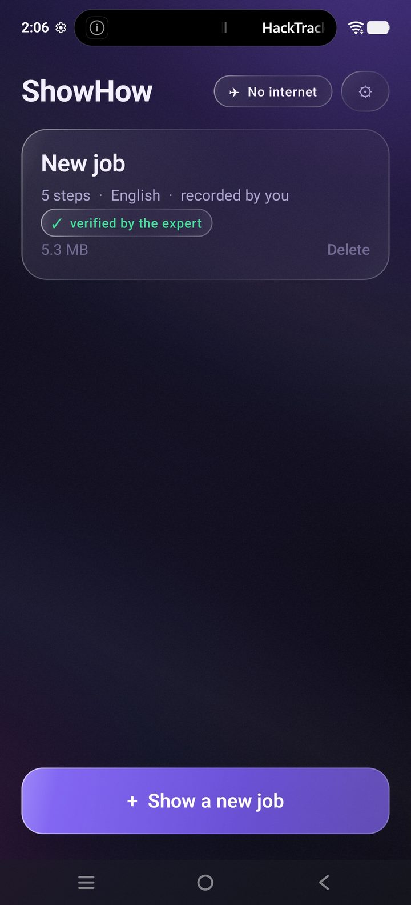
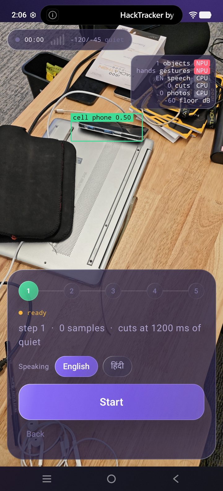
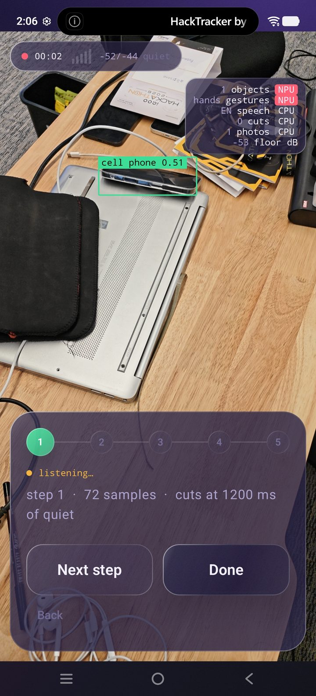
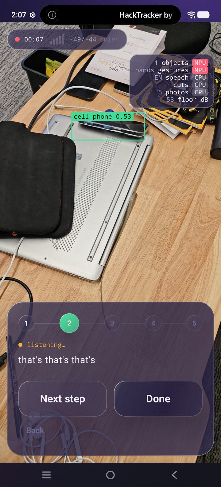
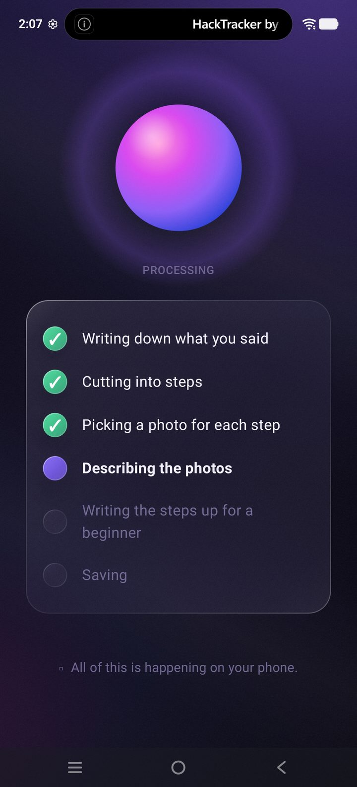
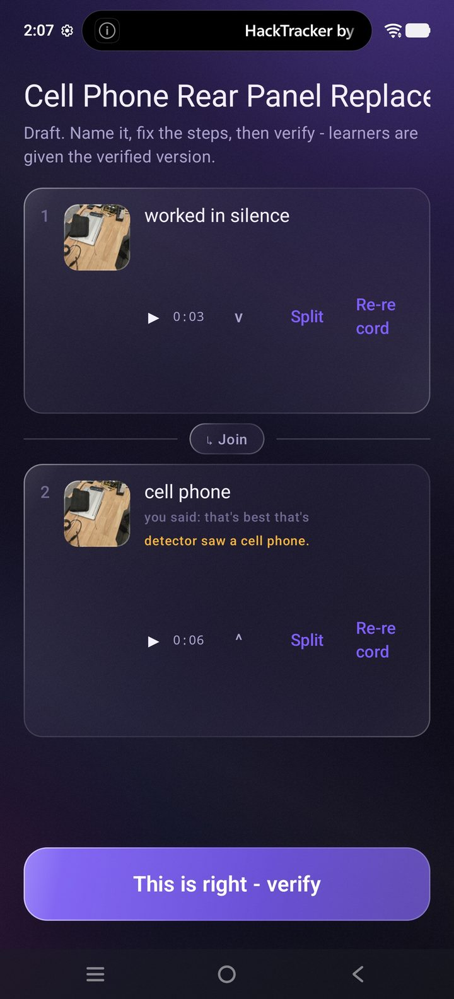
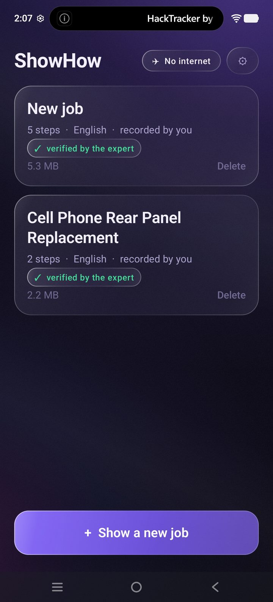
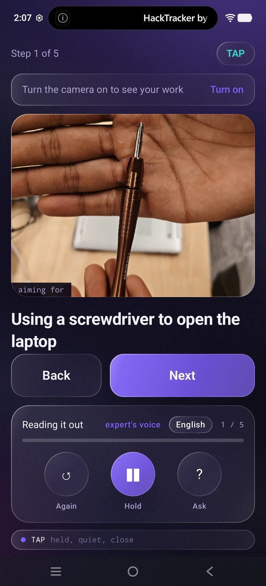
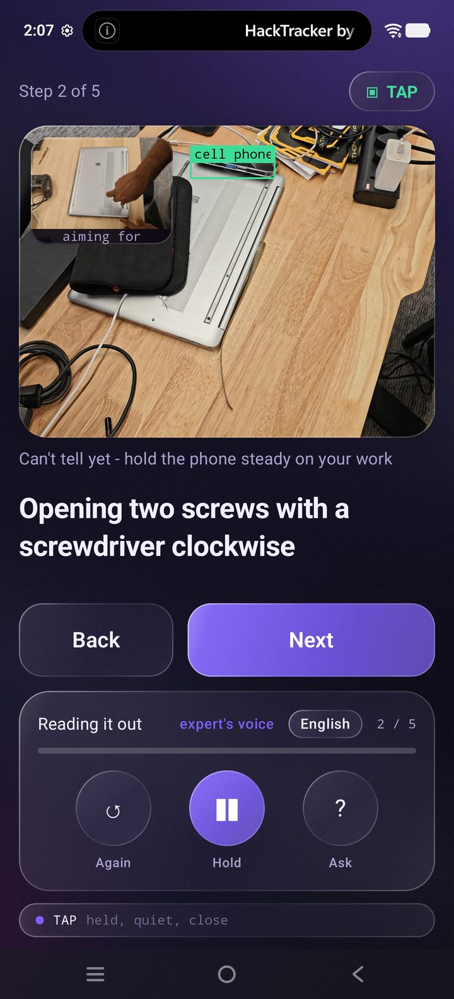

# Task Lens

An expert does a job once and narrates it in Hindi or English. The phone turns
that single take into a step-by-step guide — one photo and one slice of her own
voice per step. Anyone else then runs the guide hands-free.

**Everything runs on the device. There is no `INTERNET` permission to revoke.**

Built for iQOO City Battles 2026 — 30 hours, three people.

---

## The loop, in ten screens

### Show mode — the expert records

| | | |
|:--:|:--:|:--:|
|  |  |  |
| **Library.** One tap to start. The badge says *No internet*, and it is not decoration. | **Ready.** Pick the language you will speak. The HUD already shows what is running and where — NPU or CPU. | **Recording.** `72 samples · cuts at 1200 ms of quiet`. The noise floor is live at −53 dB. |

| | | |
|:--:|:--:|:--:|
|  |  |  |
| **Step 2, on its own.** A pause in the take became a boundary and a photo was grabbed. Speech appears as it is heard. | **Processing.** Six honest stages, and a line that says where they happen: *all of this is happening on your phone*. | **Review.** Split, join, re-record, rename. Nothing reaches a learner until an expert taps **This is right**. |

### Guide mode — the next person runs it

| | | |
|:--:|:--:|:--:|
|  |  |  |
| **Verified.** The tick is an expert putting their name to a guide. Any edit costs the tick. | **Step 1 of 5.** The expert's photo, her own voice, and a mode chip saying *TAP — held, quiet, close*. | **Camera on.** The step's photo sits inset against the live bench, and the scene check says what it can honestly tell: *can't tell yet — hold the phone steady*. |

## The four hard constraints

These are claims made to a jury. Breaking one is worse than shipping less.

1. **No `INTERNET` permission.** The manifest declares only `CAMERA` and
   `RECORD_AUDIO`, and strips `INTERNET` / `ACCESS_NETWORK_STATE` with
   `tools:node="remove"` if a dependency tries to merge them in.
2. **The step cutter is a pause detector plus a word list.** No video model,
   no ML in that path. It has to run on a five-year-old phone.
3. **The mode engine contains no AI.** Plain rules over four booleans, decided
   in under 10 ms, and every switch carries a reason string you can read.
4. **Warnings advise, they never block.** There is no disabled button in the
   app. Anything the phone cannot honestly measure is a setting, never a guess.

## The models

Six, all on-device. **A missing model is never replaced by a fake** — `Fakes.kt`
was deleted on purpose.

| Model | Job | If it is absent |
|---|---|---|
| Vosk (`vosk-android`) | Hindi and English speech **with word timings** | Empty transcripts; the pause detector stands alone |
| Gemma 3 1B int4 (`mediapipe-tasks-genai`) | Rewrites steps into English, titles the guide, answers questions | Steps stay in the expert's own words |
| Fine-tuned detector (`mediapipe-tasks-vision`) | `screwdriver` + five screw-head types | No tool boxes; COCO still names the room |
| COCO detector (`mediapipe-tasks-vision`) | laptop, keyboard, mouse, person | Tools still box; the room goes unnamed |
| Gesture recognizer (`mediapipe-tasks-vision`) | Palm and fist → ±1 step, hands-free | The buttons still work |
| Scene check (**no model file**) | "Does this bench match the guide's photo?" | Never absent — it is dHash plus an HSV histogram |

Word timings are why Vosk and not the platform recognizer: they are how a
transcript gets sliced per step. Detector numbers, both detectors running per
frame, and the training pipeline are in
[`docs/ARCHITECTURE.md §12`](docs/ARCHITECTURE.md).

**Marathi is not in the recording picker, and that is deliberate.** Vosk
publishes no Marathi model at any size, so `mr` was a button that recorded a
take and handed back an empty transcript — the exact failure this app is built
to refuse. What already exists is everything around the model: the Marathi
linking words in `policy.json`, the Narrator's `mr` voice, and the library
label. A guide already recorded as `mr` still plays. Adding the button back
needs a model on the phone first, not a line of code — which is a file push,
not a rebuild.

Model files are gitignored and belong on the phone under `filesDir/models/`.
`run-as` is required — `filesDir` is not world-writable, so a plain `adb push`
silently fails on a non-rooted phone:

```
adb push models /data/local/tmp/models
adb shell run-as com.tasklens sh -c 'cp -r /data/local/tmp/models files/'
adb shell run-as com.tasklens ls files/models        # verify before the demo
```

## Provenance — who said this

The coach is the only model allowed to say something the expert did not. The
cost of allowing it is that every instruction is labelled `EXPERT`, `VISUAL`,
`GENERAL` or `UNKNOWN`. Unknown is its own value and never leans toward the
expert: *"we never worked out where this came from"* and *"she said it"* are
different claims, and only one is safe to show a learner as her word.

The transcript is never overwritten. It is evidence, in her own language, and
it is what the Player still plays as audio.

## Layout

    core/     Pure Kotlin. ZERO android.* imports. JVM-testable in seconds.
    capture/  AudioRecorder, CameraController, MotionSource
    ai/       Asr, Captioner, GestureSource, SceneCheck, Coach — all real models
    data/     Guide, Step, GuideStore, PolicyRepository
    ui/       Compose screens and theme
    tools/    Detector training, and the robot simulation below

`core/` being android-free is not tidiness. It is why *"a room floored at −20 dB
by a ceiling fan"* is a JVM test that runs in milliseconds instead of a trip to
a real kitchen with a real fan.

## Tuning without compiling

Every number lives in `policy.json`. On first run the app copies
`assets/policy.json` into `filesDir/policy.json` and from then on reads only
that file, watching it with a `FileObserver`. Push a new one and the app
retunes live:

```
adb push policy.json /data/local/tmp/
adb shell run-as com.tasklens cp /data/local/tmp/policy.json files/policy.json
```

A malformed file is logged and ignored; the last good policy stays in force.

## The robot layer

A guide is a program, not just a document — and the proof is that a robot arm
can run one. [`tools/sim/`](tools/sim/README.md) reads the same `guide.json`
the app writes, turns each step into one of five primitives, and executes it on
a Franka Panda in PyBullet.

**Recording:** [`docs/tasklens-sim.mp4`](docs/tasklens-sim.mp4)

```
pip install pybullet pillow
adb exec-out run-as com.tasklens cat files/guides/<id>/guide.json > guide.json
python tools/sim/guide_to_program.py guide.json -o program.json
python tools/sim/run_pybullet.py program.json
```

Anything the translator cannot read confidently becomes `inspect` — the arm
moves to look and touches nothing. A guessed manipulation would be a
fabrication nobody watching the video could detect, which is the same rule the
app follows everywhere else.

## Build

Needs JDK 17 or newer (verified on Temurin 25 and on Android Studio's bundled
JBR 21). `local.properties` is gitignored — Android Studio writes it on first
open, or create it yourself with `sdk.dir=<path to your Android SDK>`.

```
./gradlew test          # core logic, JVM, seconds
./gradlew build         # both variants, plus lint
```

The two claims worth re-checking whenever a dependency changes:

```
# 1. no network permission survived the merge
grep -o 'android.permission[^"]*' app/build/intermediates/merged_manifest/*/*/AndroidManifest.xml | sort -u
# 2. core/ is still pure Kotlin
grep -rn '^import android' app/src/main/java/com/tasklens/core/
```

## Docs

| | |
|---|---|
| [`AGENTS.md`](AGENTS.md) | Constraints, ownership, commands. Read first. |
| [`docs/ARCHITECTURE.md`](docs/ARCHITECTURE.md) | The technical detail the jury questions are answered from. |
| [`docs/WORKFLOW.md`](docs/WORKFLOW.md) | Team, git and schedule rules. |
| [`tools/sim/README.md`](tools/sim/README.md) | The robot layer, and how to run it in front of judges. |
